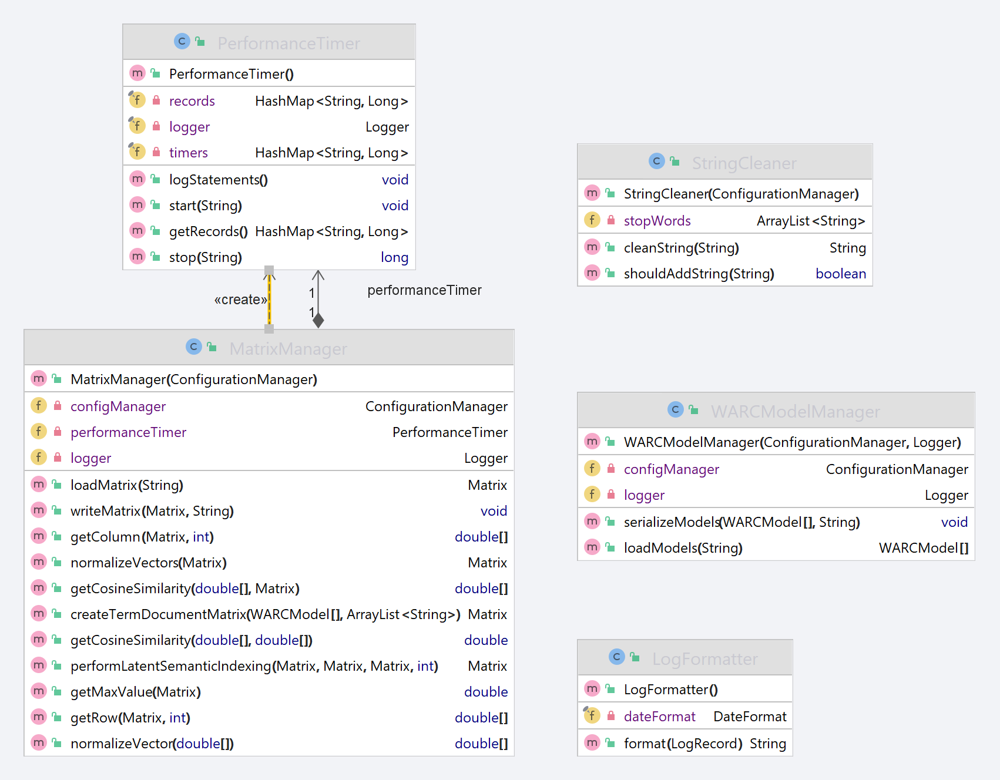

# Straubsl.io

> The purpose of the current study is to determine the chances, challenges and limitations of the vector space model applied to parts of the CommonCrawl dataset. The whole dataset cannot be considered due to computational limitations, however the conceptual approach will be applicable to any data structured in the Web ARChive format. Highlighting the limitations of the approach taken in this paper and providing an outlook on how to advance further will be a primary feature of this work, thus creating a chance for ex-panding existing knowledge.
 
Table of contents
===================
* [How to use](#how-to-use)
  * [How to start the engine](#how-to-start-the-engine)
  * [How to use CommonCrawl data](#how-to-use-commoncrawl-data)
* [Packages](#packages)
  * [PreProcessor](#preprocessor)
  * [SearchEngine](#searchengine)
  * [Util](#util)

# How to use
## How to start the engine
> Note: This repository only serves (custom) sample data, if you're interested in using real CommonCrawl data, please refer to 'How to use CommonCrawl data'
1. Clone this project
2. Add lib/Jama-1.0.3.jar as project library
3. Run `src/main/java/SearchEngine/SpringSearchApplication.java` as SpringBoot application
4. Visit http://localhost:8080/

## How to use CommonCrawl data
1. Choose which main crawl to download from CommonCrawl: https://data.commoncrawl.org/crawl-data/index.html
2. Download the paths for the WET file of chosen main crawl (example: https://data.commoncrawl.org/crawl-data/CC-MAIN-2022-40/wet.paths.gz)
3. Download the actual WET file from one of the paths in the wet.paths file from step 2 (example: https://data.commoncrawl.org/crawl-data/CC-MAIN-2022-40/segments/1664030331677.90/wet/CC-MAIN-20220924151538-20220924181538-00000.warc.wet.gz)
4. Unzip the WET file from step 3 to the /data directory
5. Update the `WET_FILE_PATH` constant in the header of `src/main/java/PreProcessor/Driver.java` to refer to the WET file in your data directory
6. Update the Data.Splitter value in the `src/main/java/PreProcessor/Configuration/preprocessor.cfg` according to your memory restrictions (the value serves as a divisor -> a higher value results in less content loaded)
7. Run `src/main/java/SearchEngine/SpringSearchApplication.java` as SpringBoot application

# Packages
## PreProcessor
> The main purpose of the PreProcessor package is to build the document-by-term matrix used by the search engine.

## SearchEngine
> The main purpose of the SearchEngine package lies in the implementation of the actual search engine.

## Util
> The main purpose of the Util package is to provide classes that contain shared functionality.

Why the name[^1]?

[^1]: Straubsl is based on a nickname of the developer and was suggested by a friend of him 